===========================
Model-View-Delegate Konzept
===========================

.. sectionauthor:: `Tobias Küchel <https://github.com/jolly-jump>`_

.. index:: GridView, ListElement, ListModel, ListView, PathView, Repeater, XmlListModel

.. issues:: ch06

.. note::

    Last Build: |today|

    The source code for this chapter can be found in the `assets folder <../../assets>`_.

In Qt Quick wird ein `Model View Controller Konzept
<https://de.wikipedia.org/wiki/Model_View_Controller>`_
umgesetzt. Dabei werden Daten von deren Darstellung über ein "model"
und ein "view" getrennt.  Für die Darstellung der Daten werden für
einzelne Datenelemente sogenannten "delegates" verwendet.  Qt Quick
hat bereits einige Modelle und Darstellungen vordefiniert. Um diese
verwenden zu können, muss man diese Klassen verstehen und wissen wie
man zugehörige "delegate" erstellt.

Das Konzept
===========

.. issues:: ch06

Ganz wichtig beim Entwickeln eines User Interfaces ist die Trennung von Daten und Darstellung zu beherzigen. Zum Beispiel könnte man ein Adressbuch als vertikale List von Texteinträgen oder als eine Tabelle von Bildern der Kontakte arrangieren. In beiden Fällen sind die Daten identisch: das Adressbuch aber die Visualisierung ist völlig anders. Die Aufteilung wird üblicherweise  Model-View-Konzept genannt. In dem Konzept ist das Telefonbuch das Modell und die Darstellung ist der "view".

In QML werden Modell und Ansicht über sogenannte Delegaten ("delegates") miteinander verbunden. Die Zuständigkeiten sind so aufgeteilt:

* Das Modell ("model") beinhaltet die Daten. Jedes Datenelement kann
  viele Werte enthalten. Im obigen Beispiel hat jede Adressbucheintrag
  einen Namen, ein Bild und eine Telefonnummer.
* Die Daten werden über eine Ansicht ("view") bereitgestellt, in
  welchem jedes Element von einem Delegaten ("delegate") dargestellt
  wird. Die Aufgabe der Ansicht ist es die Delegaten anzuordnen. Im
  Beispiel oben gäbe es mehrere mögliche Ansichten, wie man ein
  Telefonbuch darstellt, z.B. über eine Zeile pro Eintrag.
* Die Delegaten ("delegate") zeigen dann die Werte aus dem Modell dem
  Benutzer an. Im obigen Beispiel würde die Telefonnummer kursiv, der
  Name fett und die Adresse normal formatiert werden.

.. digraph:: model_view_delegate_roles

    View -> Model [label="Visualizes Model"]
    Delegate -> Model [label="Visualizes Model Rows"]
    View -> Delegate [label="Creates and Places"]

Basic Models
============

.. issues:: ch06

Die einfachste Möglichkeit, Daten und Ansicht zu trennen, ist für eine
Ansicht ein ``Repeater``-Element.  Man verwendet es, um ein Datenfeld
("array") von Elementen zu erzeugen und es ist einfach mit
Positionselementen kombinierbar um das User Interface aufzubauen.  Ein
Repeater benötigt ein Modell, das kann eine Zahl sein, die die
Delegaten einfach genau so oft erzeugt oder ein viel komplexeres
Modell mit Daten aus dem Internet.

In der einfachsten Form, wird der Repeater verwendet um eine Anzahl
von Elementen zu erzeugen. Jedes Objekt hat dann Zugriff auf die
definierten Eigenschaften und zusätzlich auf die Variable ``index`` um
die Elemente von einander zu trennen.  Im untenstehenden Beispiel
werden zehn Instanzen eines Objekts "BlueBox" erzeugt. ("BlueBox" ist
ein Delegat, siehe unten). Die Anzahl wird von der
Eigenschaft ``model`` gesteuert. Für jedes "BlueBox"-Objekt wird das
darin definierte ``Text``-Element erstellt, dessen Wert auf die
Variable ``index`` gesetzt wird. So können die durchnummerierten
Elemente unterschieden werden.

.. _ex01:

.. literalinclude:: src/repeater/number.qml
    :start-after: M1>>
    :end-before: <<M1

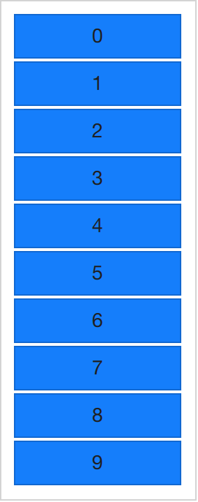

Nummerierte Elemente sind zwar schön, aber manchmal möchte man
komplexere Daten darstellen. Statt einer einfachen Zahl füttern wird
``model`` mit einem JavaScript Array. Der Inhalt eines Arrays kann
alles mögliche sein: Zeichenketten, Zahlen oder Objekte.  Im
untenstehenden Beispiel wird eine Liste von Zeichenketten
verwendet. Wir können die ``index``-Variable weiterhin verwenden aber
wir können jetzt auch auf einzelne Datenelemente zugreifen, indem wir
auf die spezielle Eigenschaft ``modelData`` zugreifen, die dann den
Wert des aktuellen Elements enthält.

.. _ex02:

.. literalinclude:: src/repeater/array.qml
    :start-after: M1>>
    :end-before: <<M1

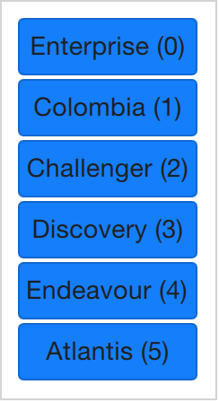

Weil man jetzt Daten eines Array darstellen kann, will man auch
mehrere Daten pro Array-Element darstellen können. Dafür braucht man
jetzt bessere Modelle. Eines der trivialsten Modelle aber auch eines
der weit verbreitetsten ist das ``ListModel``. Ein ListModel ist eine
Zusammenstellung von ``ListElement`` Elementen. Innerhalb jedes
solchen Listenelements kann es mehrere Eigenschaften mit Werten
geben. Im folgenden Beispiel ein Name und eine Farbe für jedes
Element.

Die Eigenschaft (z.B. Farbe) in jedem Element wird von der Ansicht
"Repeater" dann dem jeweiligen Objekt (hier: BlueBox) zugeordnet,
d.h. die Variablen ``name`` und ``surfaceColor`` sind dann im Objekt
``Rectangle`` und ``Text`` erreichbar und werden als Werte verwendet.
Man kommt so nicht nur einfach an die Daten, es macht den Quellcode
auch einfach lesbarer. ``surfaceColor`` ist jetzt die Farbe des
kleinen Kreises links neben dem Namen und nicht so etwas Seltsames wie
``data[i][j]``.

.. _ex03:

.. literalinclude:: src/repeater/model.qml
    :start-after: M1>>
    :end-before: <<M1

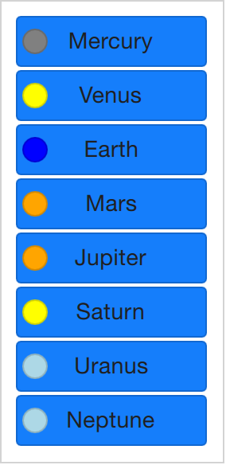

Der letztendliche Darstellung, welche in einer "Repeater"-Ansicht für
jedes Datenobjekt erzeugt wird, nennt man Delegat und wird mit der
Eigenschaft ``delegate`` ausgezeichnet. Bisher wurde dieses
Schlüsselwort nur nicht verwendet. Das heißt, der Beispielcode
:ref:`Example 01 <ex01>` ist gleichbedeutend zum folgenden Code. Der
Unterschied ist, dass der Delegat jetzt explizit benannt wurde.

.. _ex04:

.. literalinclude:: src/repeater/delegate.qml
    :start-after: M1>>
    :end-before: <<M1

Dynamic Views
=============

.. issues:: ch06

Repeater funktionieren zwar gut für begrenzte, nicht veränderbare
Datensätze aber im wirklichen Leben sind Modelle eher komplexer und
größer. Es werden bessere Lösungen gebraucht. Qt Quick stellt die
Elemente ``ListView`` und ``GridView`` bereit. Diese sind von einer
``Flickable``-Fläche abgeleitet, so dass sich der Benutzer in Darstellungen
großer Datensätze bewegen kann.  Gleichzeitig begrenzen sie die Anzahl
gleichzeitig erzeugter und dargestellter Delegaten und das bedeutet
dass nur wenigen wirklich sichtbaren Elemente aus einem großen
Datensatz dargestellt werden.

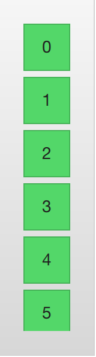

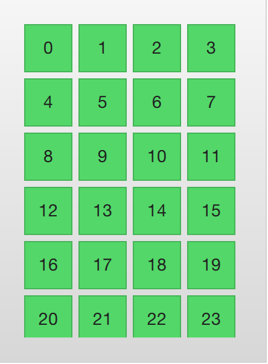

Beide Elemente sind sehr ähnlich in der Benutzung. Wir beginnen mit
dem ``ListView`` und beschreiben dann den ``GridView`` um sie beide zu
vergleichen.

Die Ansicht ``ListView`` ist dem ``Repeater`` Element sehr ähnlich. Es
verwendet ein ``model`` und instantiiert einen Delegaten ``delegate``
und zwischen den Delegaten kann es ``spacing`` geben. Der folgende
Code zeigt ein einfaches Setup.

.. literalinclude:: src/listview/basic.qml
    :start-after: M1>>
    :end-before: <<M1

Wenn das Modell mehr Daten enthält als auf den Bildschirm passt, zeigt
``ListView`` nur einen Teil der Daten. Das Standardverhalten von Qt
Quick beschränkt die Anzeige eines ListView allerdings nicht auf die
Bildschirmfläche in der die Delegatenansichten gezeigt werden. Die
Delegaten können ausserhalb der ListView sichtbar sein und immer wenn
das Programm dynamisch Delegaten hinzufügt oder löscht, könnten diese
für den User sichtbar sein. Um das zu verhindern muss das Abschneiden
("clipping") für das Listview-Element aktiviert werden. Die folgende
Illustration zeigt das Ergebnis von clipping (links) im Vergleich zu
ohne clipping (rechts).

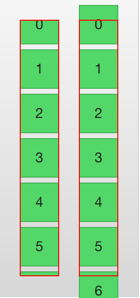

Für den Benutzer ist die Ansicht ``ListView`` eine scrollbare
Fläche. Es unterstützt kinetisches Scrollen, d.h. man kann sehr
schnell durch den Inhalt wischen. Standardmäßig kann es auch über das
Ende und den Anfang hinaus gezogen werden, worauf es zurückfedert um
dem Benutzer zu zeigen, dass Anfang oder Ende erreicht wurden.

Das Verhalten am Ende der Ansicht wird über die Eigenschaft
``boundsBehavior`` gesteuert. Diese Eigentschaft kann zählbare Werte
enthalten, standardmäßig bedeutet ``Flickable.DragAndOvershootBounds``
dass die Ansicht sowohl über seine Grenzen gezogen als auch gewischt
werden kann. Mit ``Flickable.StopAtBounds`` wird die Ansicht nie über
die Grenze gehen und mit ``Flickable.DragOverBounds`` kann der
Benutzer durch ziehen über die Grenze treten, nicht allerdings durch
schnelles Wischen.

It is possible to limit the positions where a view is allowed to stop. This is controlled using the ``snapMode`` property. The default behavior, ``ListView.NoSnap``, lets the view stop at any position. By setting the ``snapMode`` property to ``ListView.SnapToItem``, the view will always align the top of an item with its top. Finally, the ``ListView.SnapOneItem``, the view will stop no more than one item from the first visible item when the mouse button or touch was released. The last mode is very handy when flipping through pages.

Hoch- oder Querformat
---------------------

.. issues:: ch06

Die "ListView"-Ansicht erlaubt neben vertikaler Anzeige und Scrollen auch horizontales Scrollen, welches genauso nützlich sein kann. Die Ausrichtung der "ListView"-Ansicht wird von der Eigenschaft ``orientation`` gesteuert. Es kann entweder den Standardwert ``ListView.Vertical`` oder den Wert ``ListView.Horizontal`` bekommen. Im folgenden sieht man letzteres.

.. literalinclude:: src/listview/horizontal.qml
    :start-after: M1>>
    :end-before: <<M1

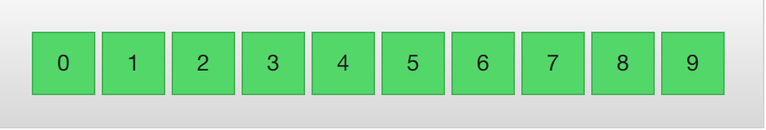

Wie man sich vorstellen kann geht die Richtung der horizontalen
Darstellung von links nach recht. Über die Eigentschaft
``layoutDirection`` kann man mit ``Qt.LeftToRight`` oder mit
``Qt.RightToLeft`` die Darstellungrichtung beeinflussen.

Keyboard Navigation and Highlighting
------------------------------------

.. issues:: ch06

When using a ``ListView`` in a touch based setting, the view itself is enough. In a scenario with a keyboard, or even just arrow keys to select an item, a mechanism to indicate the current item is needed. In QML, this is called highlighting.

Views support a highlight delegate which is shown in the view together with the delegates. It can be considered an additional delegate, only that it is only instantiated once, and is moved into the same position as the current item.

In the example below this is demonstrated. There are two properties involved for this to work. First, the ``focus`` property is set to true. This gives the ``ListView`` the keyboard focus. Second, the ``highlight`` property is set to point out the highlighting delegate to use. The highlight delegate is given the ``x``, ``y`` and ``height`` of the current item. If the ``width`` is not specified, the width of the current item is also used.

In the example, the ``ListView.view.width`` attached property is used for width. The attached properties available to delegates are discussed further in the delegate section of this chapter, but it is good to know that the same properties are available to highlight delegates as well.

.. literalinclude:: src/listview/highlight.qml
    :start-after: M1>>
    :end-before: <<M1

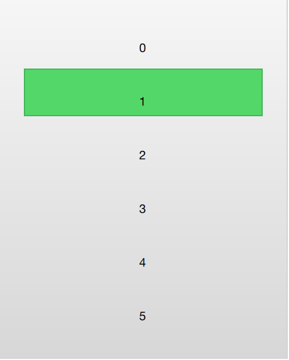

When using a highlight in conjunction with a ``ListView``, a number of properties can be used to control its behavior. The ``highlightRangeMode`` controls how the highlight is affected by what is shown in the view. The default setting, ``ListView.NoHighlightRange`` means that the highlight and the visible range of items in the view not are related at all.

The value ``ListView.StrictlyEnforceRange`` ensures that the highlight is always visible. If an action attempts to move the highlight outside the visible part of the view, the current item will change accordingly, so that the highlight remains visible.

The middle ground is the ``ListView.ApplyRange`` value. It attempts to keep the highlight visible, but does not alter the current item to enforce this. Instead, the highlight is allowed to move out of view if necessary.

In the default configuration, the view is responsible for moving the highlight into position. The speed of the movement and resizing can be controlled, either as a speed or as a duration. The properties involved are ``highlightMoveSpeed``, ``highlightMoveDuration``, ``highlightResizeSpeed`` and ``highlightResizeDuration``. By default, the speed is set to 400 pixels per second, and the duration is set to -1, indicating that the speed and distance control the duration. If both a speed and a duration is set, the one that results in the quickest animation is chosen.

To control the movement of the highlight more in detail, the ``highlightFollowCurrentItem`` property can be set to ``false``. This means that the view is no longer responsible for the movement of the highlight delegate. Instead, the movement can be controlled through a ``Behavior`` or an animation.

In the example below, the ``y`` property of the highlight delegate is bound to the ``ListView.view.currentItem.y`` attached property. This ensures that the highlight follows the current item. However, as we do not let the view move the highlight, we can control how the element is moved. This is done through the ``Behavior on y``. In the example below, the movement is divided into three steps: fading out, moving, before fading in. Notice how ``SequentialAnimation`` and ``PropertyAnimation`` elements can be used in combination with the ``NumberAnimation`` to create a more complex movement.

.. literalinclude:: src/listview/highlight-custom.qml
    :start-after: M1>>
    :end-before: <<M1

Header and Footer
-----------------

.. issues:: ch06

At the end of the ``ListView`` contents, a ``header`` and a ``footer`` element can be inserted. These can be considered special delegates places at the beginning or end of the list. For a horizontal list, these will not appear at the head or foot, but rather at then beginning or end, depending on the ``layoutDirection`` used.

The example below illustrates how an header and footer can be used to enhance the perception of the beginning and end of a list. There are other uses for these special list elements. For instance, they can be used to keep buttons to load more contents.

.. literalinclude:: src/listview/header-footer.qml
    :start-after: M1>>
    :end-before: <<M1

.. note:: Header and footer delegates do not respect the ``spacing`` property of a ``ListView``, instead they are placed directly adjacent to the next item delegate in the list. This means that any spacing must be a part of the header and footer items.

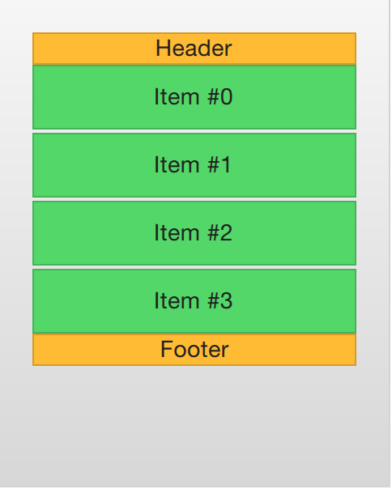

The GridView
------------

.. issues:: ch06

Using a ``GridView`` is very similar to using a ``ListView``. The only real difference is that the grid view places the delegates in a two dimensional grid instead of in a linear list.

Compared to a list view, the grid view does not rely on spacing and the size of its delegates. Instead, it uses the ``cellWidth`` and ``cellHeight`` properties to control the dimensions of the contents delegates. Each delegate item is then places in the top left corner of each such cell.

.. literalinclude:: src/gridview/basic.qml
    :start-after: M1>>
    :end-before: <<M1

A ``GridView`` contains headers and footers, can use a highlight delegate and supports snap modes as well as various bounds behaviors. It can also be orientated in different directions and orientations.

The orientation is controlled using the ``flow`` property. It can be set to either ``GridView.LeftToRight`` or ``GridView.TopToBottom``. The former value fills a grid from the left to the right, adding rows from the top to the bottom. The view is scrollable in the vertical direction. The latter value adds items from the top to the bottom, filling the view from left to right. The scrolling direction is horizontal in this case.

In addition to the ``flow`` property, the ``layoutDirection`` property can adapt the direction of the grid to left-to-right or right-to-left languages, depending on the value used.

Der Delegat
===========

.. issues:: ch06

When it comes to using models and views in a custom user interface, the delegate plays a huge role in creating a look. As each item in a the model are visualized through a delegate, what is actually visible to the user are the delegates.

Each delegate gets access to a number of attached properties, some from the data model, others from the view. From the model, the properties convey the data for each item to the delegate. From the view, the properties convey state information related to the delegate within the view.

The most commonly used properties attached from the view are ``ListView.isCurrentItem`` and ``ListView.view``. The first is a boolean indicating if the item is the current item, while the latter is a read-only reference to the actual view. Through access to the view, it is possible to create general, reusable delegates that adapt to the size and nature of the view in which they are contained. In the example below, the ``width`` of each delegate is bound to the ``width`` of the view, while the background ``color`` of each delegate depends on the attached ``ListView.isCurrentItem`` property.

.. literalinclude:: src/delegates/basic.qml
    :start-after: M1>>
    :end-before: <<M1

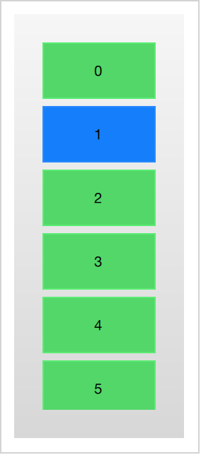

If each item in the model is associated with an action, for instance, clicking an item acts upon it, that functionality is a part of each delegate. This divides the event management between the view, which handles the navigation between items in the view, and the delegate which handles actions on a specific item.

The most basic way to do this is to create a ``MouseArea`` within each delegate and act on the ``onClicked`` signal. This is demonstrated in the example in the next section of this chapter.

Animating Added and Removed Items
---------------------------------

.. issues:: ch06

In some cases, the contents shown in a view changes over time. Items are added and removed as the underlaying data model is altered. In these cases, it is often a good idea to employ visual ques to give the user a sense of direction and to help the user understand what data is added or removed.

Conveniently enough, QML views attaches two signals, ``onAdd`` and ``onRemove``, to each item delegate. By connecting animations to these, it is easy to create the movement necessary to aid the user in identifying what is taking place.

The example below demonstrates this through the use of a dynamically populated ``ListModel``. At the bottom of the screen, a button for adding new items is shown. When it is clicked, a new item is added to the model using the ``append`` method. This triggers the creation of a new delegate in the view, and the emission of the ``GridView.onAdd`` signal. The ``SequentialAnimation`` attached to the signal causes the item to zoom into view by animating the ``scale`` property of the delegate.

When a delegate in the view is clicked, the item is removed from the model through a call to the ``remove`` method. This causes the ``GridView.onRemove`` signal to be emitted, triggering another ``SequentialAnimation``. This time, however, the destruction of the delegate must be delayed until the animation has completed. To do this, ``PropertyAction`` element are used to set the ``GridView.delayRemove`` property to ``true`` before the animation, and ``false`` after. This ensures that the animation is allowed to complete before the delegate item is removed.

.. literalinclude:: src/delegates/add-remove-effects.qml
    :start-after: M1>>
    :end-before: <<M1

Shape-Shifting Delegates
------------------------

.. issues:: ch06

A commonly used mechanism in lists is that the current item is expanded when activated. This can be used to dynamically let the item expand to fill the screen to enter a new part of the user interface, or it can be used to provide slightly more information for the current item in a given list.

In the example below, each item is expanded to the full extent of the ``ListView`` containing it when clicked. The extra spaced is then used to add more information. The mechanism used to control this is a state, ``expanded`` that each item delegate can enter, where the item is expanded. In that state, a number of properties are altered.

First of all, the ``height`` of the ``wrapper`` is set to the height of the ``ListView``. The thumbnail image is then enlarged and moved down to make it move from its small position into its larger position. In addition to this, the two hidden items, the ``factsView`` and ``closeButton`` are shown by altering the ``opacity`` of the elements. Finally, the ``ListView`` is setup.

Setting up the ``ListView`` involves setting the ``contentsY``, that is the top of the visible part of the view, to the ``y`` value of the delegate. The other change is to set ``interactive`` of the view to ``false``. This prevents the view from moving. The user can no longer scroll through the list or change the current item.

As the item first is clicked, it enters the ``expanded`` state, causing the item delegate to fill the ``ListView`` and the contents to rearrange. When the close button is clicked, the state is cleared, causing the delegate to return to its previous state and re-enabling the ``ListView``.

.. literalinclude:: src/delegates/expanding.qml
    :start-after: M1>>
    :end-before: <<M1

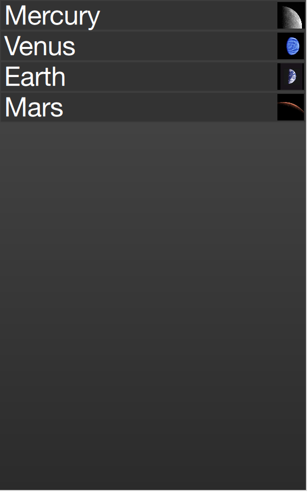

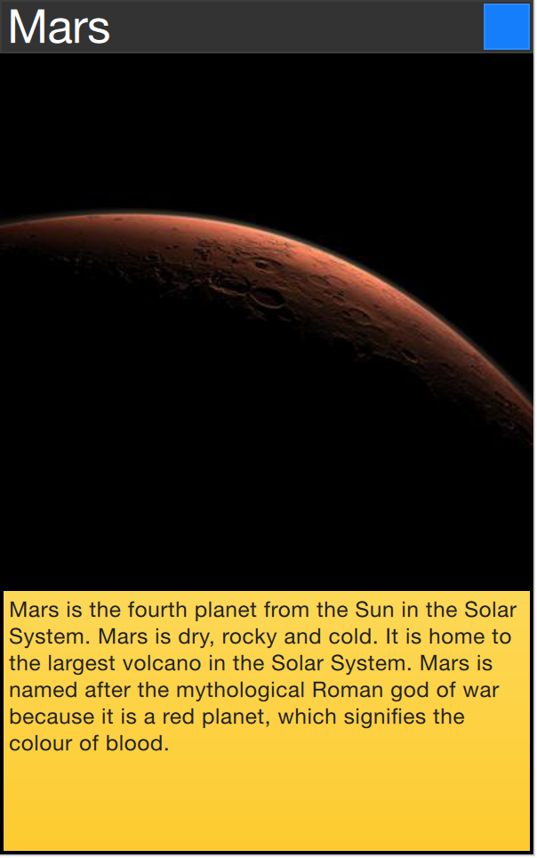

The techniques demonstrated here to expand the delegate to fill the entire view can be employed to make an item delegate shift shape in a much smaller way. For instance, when browsing through a list of songs, the current item could be made slightly larger, accommodating more information about that particular item.

Advanced Techniques
===================

.. issues:: ch06

The PathView
------------

.. issues:: ch06

The ``PathView`` element is the most powerful, but also the most complex, view provided in Qt Quick. It makes it possible to create a view where the items are laid out along an arbitrary path. Along the same path, attributes such as scale, opacity and more can be controlled in detail.

When using the ``PathView``, you have to define a delegate and a path. In addition to this, the ``PathView`` itself can be customized through a range of properties. The most common being ``pathItemCount``, controlling the number of visible items at once, and the highlight range control properties ``preferredHighlightBegin``, ``preferredHighlightEnd`` and ``highlightRangeMode``, controlling where along the path the current item is to be shown.

Before looking at the highlight range control properties in depth, we must look at the ``path`` property. The ``path`` property expects a ``Path`` element defining the path that the delegates follows as the ``PathView`` is being scrolled. The path is defined using the ``startX`` and ``startY`` properties in combinations with path elements such as ``PathLine``, ``PathQuad`` and ``PathCubic``.  These elements are joined together to form a two-dimensional path.

.. todo:: do we cover the line, quad and cubic through an illustration, or do we need a paragraph on them?

When the path has been defined, it is possible to further tune it using ``PathPercent`` and ``PathAttribute`` elements. These are placed in between path elements and provides a more fine grained control over the path and the delegates on it. The ``PathPercent`` controls how large a portion of the path that has been covered between each element. This, in turn, controls the distribution of delegates along the path, as they are distributed proportionally to the percentage progressed.

This is where the ``preferredHighlightBegin`` and ``preferredHighlightEnd`` properties of the ``PathView`` enters the picture. They both expect real values in the range between zero and one. The end is also expected to be more or equal to the beginning. Setting both these properties to, for instance, 0.5, the current item will be displayed at the location fifty percent along the path.

In the ``Path``, the ``PathAttribute`` elements are placed between elements, just as ``PathPercent`` elements. They let you specify property values that are interpolated along the path. These properties are attached to the delegates and can be used to control any conceivable property.

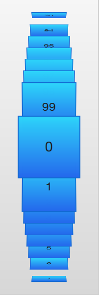

The example below demonstrates how the ``PathView`` element is used to create view of cards that the user can flip through. It employs a number of tricks to do this. The path consists of three ``PathLine`` elements. Using ``PathPercent`` elements, the central element is properly centered and provided enough space not to be cluttered by other elements. Using ``PathAttribute`` elements, the rotation, size and ``z``-value are controlled.

In addition to the ``path``, the ``pathItemCount`` property of the ``PathView`` has been set. This controls how densely populated the path will be. The ``preferredHighlightBegin`` and ``preferredHighlightEnd`` the ``PathView.onPath`` is used to control the visibility of the delegates.

.. literalinclude:: src/pathview/coverview.qml
    :start-after: M1>>
    :end-before: <<M1

The delegate, shown below, utilizes the attached properties ``itemZ``, ``itemAngle`` and ``itemScale`` from the ``PathAttribute`` elements. It is worth noticing that the attached properties of the delegate only are available from the ``wrapper``. Thus, the ``rotX`` property is defined to be able to access the value from within the ``Rotation`` element.

Another detail specific to ``PathView`` worth noticing is the usage of the attached ``PathView.onPath`` property. It is common practice to bind the visibility to this, as this allows the ``PathView`` to keep invisible elements for caching purposes. This can usually not be handled through clipping, as the item delegates of a ``PathView`` are placed more freely than the item delegates of ``ListView`` or ``GridView`` views.

.. literalinclude:: src/pathview/coverview.qml
    :start-after: M2>>
    :end-before: <<M2

When transforming images or other complex elements on in ``PathView``, a performance optimization trick that is common to use is to bind the ``smooth`` property of the ``Image`` element to the attached property ``PathView.view.moving``. This means that the images are less pretty while moving, but smoothly transformed when stationary. There is no point spending processing power on smooth scaling when the view is in motion, as the user will not be able to see this anyway.

A Model from XML
----------------

.. issues:: ch06

As XML is an ubiquitous data format, QML provides the ``XmlListModel`` element that exposes XML data as a model. The element can fetch XML data locally or remotely and then processes the data using XPath expressions.

The example below demonstrates fetching images from an RSS flow. The ``source`` property refers to a remove location over HTTP, and the data is automatically downloaded.

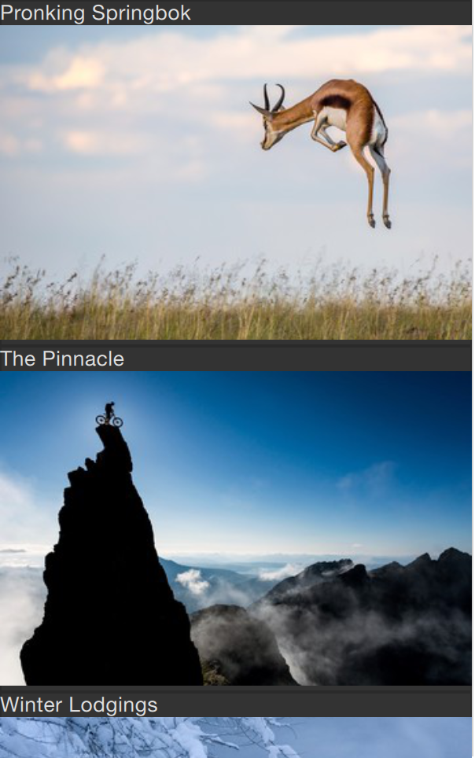

When the data has been downloaded, it is processed into model items and roles. The ``query`` property is an XPath representing the base query for creating model items. In this example, the path is ``/rss/channel/item``, so for every item tag, inside a channel tag, inside an RSS tag, a model item is created.

For every model item, a number of roles are extracted. These are represented by ``XmlRole`` elements. Each role is given a name, which the delegate can access through an attached property. The actual value of each such property is determined through the XPath query for each role. For instance, the ``title`` property corresponds to the ``title/string()`` query, returning the contents between the ``<title>`` and ``</title>`` tags.

The ``imageSource`` property is more interesting as it not only extracts a string from the XML, but also processes it. In the stream provided, every item contains an image, represented by an ``>
    :end-before: <<M1

Lists with Sections
-------------------

.. issues:: ch06

Sometimes, the data in a list can be divided into sections. It can be as simple as dividing a list of contacts into sections under each letter of the alphabet or music tracks under albums. Using a ``ListView`` it is possible to divide a flat list into categories, providing more depth to the experience.

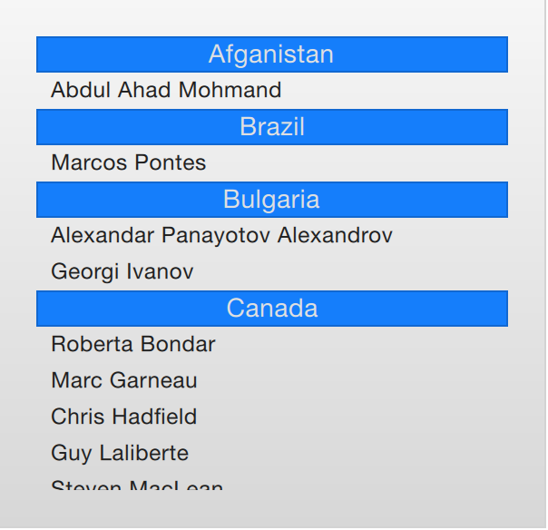

In order to use sections, the ``section.property`` and ``section.criteria`` must be setup. The ``section.property`` defines which property to use to divide the contents into sections. Here, it is important to know that the model must be sorted so that each section consists of continuous elements, otherwise, the same property name might appear in multiple locations.

The ``section.criteria`` can be set to either ``ViewSection.FullString`` or ``ViewSection.FirstCharacter``. The first is the default value and can be used for models that have clear sections, for example tracks of music albums. The latter takes the first character of a property and means that any property can be used for this. The most common example being the last name of contacts in a phone book.

When the sections have been defined, they can be accessed from each item using the attached properties ``ListView.section``, ``ListView.previousSection`` and ``ListView.nextSection``. Using these properties, it is possible to detect the first and last item of a section and act accordingly.

It is also possible to assign a section delegate component to the ``section.delegate`` property of a ``ListView``. This creates a section header delegate which is inserted before any items of a section. The delegate component can access the name of the current section using the attached property ``section``.

The example below demonstrates the section concept by showing a list of space men sectioned after their nationality. The ``nation`` is used as the ``section.property``. The ``section.delegate`` component, ``sectionDelegate``, shows a heading for each nation, displaying the name of the nation. In each section, the names of the space men are shown using the ``spaceManDelegate`` component.

.. literalinclude:: src/listview/sections.qml
    :start-after: M1>>
    :end-before: <<M1

Tuning Performance
------------------

.. issues:: ch06

The perceived performance of a view of a model depends very much on the time needed to prepare new delegates. For instance, when scrolling downwards through a ListView, delegates are added just outside the view on the bottom and are removed just as they leave sight over the top of the view. This becomes apparent if the ``clip`` property is set to ``false``. If the delegates takes too much time to initialize, it will become apparent to the user as soon as the view is scrolled too quickly.

To work around this issue you can tune the margins, in pixels, on the sides of a scrolling view. This is done using the ``cacheBuffer`` property. In the case described above, vertical scrolling, it will control how many pixels above and below the ListView that will contain prepared delegates. Combining this with asynchronously loading ``Image`` elements can, for instance, give the images time to load before they are brought into view.

Having more delegates sacrifices memory for a smoother experience and slightly more time to initialize each delegate. This does not solve the problem of complex delegates. Each time a delegate is instantiated, its contents is evaluated and compiled. This takes time, and if it takes too much time, it will lead to a poor scrolling experience. Having many elements in a delegate will also degrade the scrolling performance. It simply costs cycles to move many elements.

To remedy the two later issues, it is recommended to use ``Loader`` elements. These can be used to instantiate additional elements when they are needed. For instance, an expanding delegate may use a ``Loader`` to postpone the instantiation of its detailed view until it is needed. For the same reason, it is good to keep the amount of JavaScript to a minimum in each delegate. It is better to let them call complex pieced of JavaScript that reside outside each delegate. This reduces the time spent compiling JavaScript each time a delegate is created.

Summary
=======

.. issues:: ch06

In this chapter, we have looked at models, views and delegates. For each data entry in a model, a view instantiates a delegate visualizing the data. This separates the data from the presentation.

A model can be a single integer, where the ``index`` variable is provided to the delegate. If a JavaScript array is used as model, the ``modelData`` variable represents the data of the current index of the array, while ``index`` holds the index. For more complex cases, where multiple values needs to be provided by each data item, a ``ListModel`` populated with ``ListElement`` items is a better solution.

For static models, a ``Repeater`` can be used as the view. It is easy to combine it with a positioner such as ``Row``, ``Column``, ``Grid`` or ``Flow`` to build user interface parts. For dynamic or large data models, a view such as ``ListView`` or ``GridView`` are more appropriate. These create delegate instances on the fly as they are needed, reducing the number of elements live in the scene at once.

The delegates used in the views can be static items with properties bound to data from the model, or they can be dynamic, with states depending on if they are in focus or not. Using the ``onAdd`` and ``onRemove`` signals of the view, they can even be animated as they appear and disappear.
